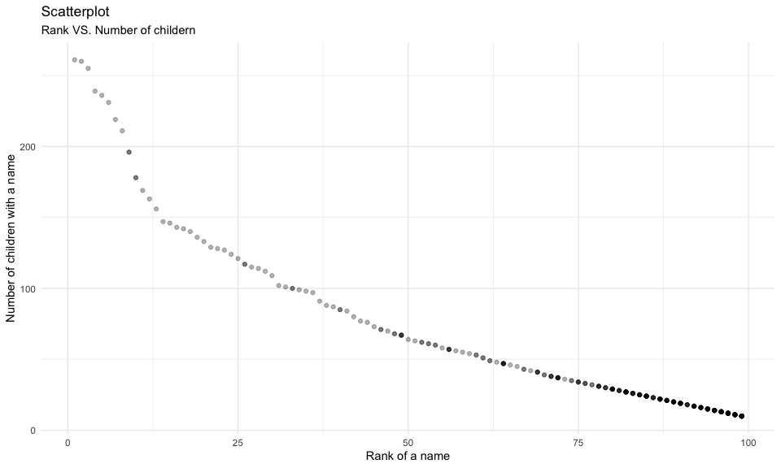

p8105\_hw2\_qw2331
================

## Problem 1

Read & clean the Mr. Trash Wheel sheet

``` r
trash_df <- 
  read_excel(
    "data/Trash-Wheel-Collection-Totals-7-2020-2.xlsx",
    sheet = "Mr. Trash Wheel",
    range = "A2:N408") %>% 
  janitor::clean_names() %>% 
  filter(is.na(dumpster) == FALSE) %>% 
  mutate(sports_balls = round(sports_balls))
```

Read & clean precipitation data for 2018 and 2019

``` r
# Read and clean precipitation data for 2018
precip18_df <- 
  read_excel(
    "data/Trash-Wheel-Collection-Totals-7-2020-2.xlsx",
    sheet = "2018 Precipitation",
    range = "A2:B14") %>% 
  janitor::clean_names() %>% 
  drop_na(month) %>% 
  mutate(year = 2018)

# Read and clean precipitation data for 2019
precip19_df <- 
  read_excel(
    "data/Trash-Wheel-Collection-Totals-7-2020-2.xlsx",
    sheet = "2019 Precipitation",
    range = "A2:B14") %>% 
  janitor::clean_names() %>% 
  drop_na(month) %>% 
  mutate(year = 2019)

# Combine two data frame & convert `month`
precip_df <- 
  bind_rows(precip18_df, precip19_df) %>% 
  janitor::clean_names() %>% 
  mutate(month = month.name[month])
```

There are `345` observations in the Mr. Trash Wheel dataframe after
cleanness and `24` in the second one after combination. Among all `14`
variables in dataset `trash_df`
(`dumpster, month, year, date, weight_tons, volume_cubic_yards, plastic_bottles, polystyrene, cigarette_butts, glass_bottles, grocery_bags, chip_bags, sports_balls, homes_powered`)
and `3` variables in the dataset `precip_df` (`month, total, year`). The
key variables are `month` and `year` since they are in both datasets and
can be used to join these two datasets.

For available data, the total precipitation in 2018 is `70.33` and the
median number of sports balls in a dumpster in 2019 is `9`.

## Problem 2

Clean `pols-month.csv`

``` r
pols_df <- 
  read_csv("data/fivethirtyeight_datasets/pols-month.csv") %>% 
  janitor::clean_names() %>% 
  separate(mon, into = c("year", "month", "day")) %>% 
  mutate(year = as.integer(year),
         month = as.integer(month), 
         day = as.integer(day),
         month = month.name[month],
         president = ifelse(prez_gop == 0, "dem", "gop")
         ) %>% 
  select(-prez_dem & -prez_gop & -day) %>% 
  relocate(year, month, president)
```

Clean `snp.csv`

``` r
snp_df <- 
  read_csv("data/fivethirtyeight_datasets/snp.csv") %>% 
  janitor::clean_names() %>% 
  mutate(date = lubridate::mdy(date)) %>% 
  separate(date, into = c("year", "month", "day")) %>% 
  mutate(year = as.integer(year),
         month = as.integer(month),
         day = as.integer(day),
         month = month.name[month]) %>% 
  select(-day) %>% 
  arrange(year, month) %>% 
  relocate(year, month)
```

Tidy `unemployment.csv` up

``` r
unemploy_df <- 
  read_csv("data/fivethirtyeight_datasets/unemployment.csv") %>%
  pivot_longer(
    Jan:Dec,
    names_to = "month",
    values_to = "unemploy_pect"
  ) %>% 
  janitor::clean_names() %>% 
  mutate(year = as.integer(year),
         month = match(month, month.abb),
         month = month.name[month])
```

Join the datasets by merging `snp`, `pols`, and `unemployment`

``` r
PolEco_df <- 
  left_join(pols_df, snp_df, by = c("year", "month")) %>% 
  left_join(unemploy_df, by = c("year", "month"))
```

The `pols_df` contains `822` observations of `9` variables related to
the number of national politicians at any given time;  
The `snp_df` contains `787` observations of `3` variables related to
Standard & Poor’s stock market index;  
The `unemploy_df` contains `816` observations of `3` variables related
to the percentage of unemployment in ant given time.

After merging all the datasets, the resulting dataframe `PolEco_df`
contains `822` obervations of `11` variables. The variable `year` ranges
from `1947` to `2015`. And the names of key variables are `year` and
`month`.

## Problem 3

Load `Popular_Baby_Names.csv` and tidy up

``` r
popbaby_df <- 
  read_csv("data/Popular_Baby_Names.csv") %>% 
  janitor::clean_names() %>% 
  rename(first_name = childs_first_name) %>% 
  mutate(
    gender = tolower(gender),
    ethnicity = tolower(ethnicity),
    first_name = tolower(first_name),
    first_name = capitalize(first_name),
    ethnicity = recode(ethnicity, 
                       "asian and pacific islander" = "asian and paci",
                       "black non hispanic" = "black non hisp",
                       "white non hispanic" = "white non hisp")
  ) %>% 
  distinct()
```

Produce table showing the rank of female name “Olivia”

``` r
olivia_df <- 
  filter(popbaby_df, first_name == "Olivia" & gender == "female") %>% 
  select(-count) %>% 
  pivot_wider(
    names_from = "year_of_birth",
    values_from = "rank"
  ) %>% 
  relocate(c(1:3), c(9:4))

olivia_df %>% 
  knitr::kable()
```

| gender | ethnicity      | first\_name | 2011 | 2012 | 2013 | 2014 | 2015 | 2016 |
|:-------|:---------------|:------------|-----:|-----:|-----:|-----:|-----:|-----:|
| female | asian and paci | Olivia      |    4 |    3 |    3 |    1 |    1 |    1 |
| female | black non hisp | Olivia      |   10 |    8 |    6 |    8 |    4 |    8 |
| female | hispanic       | Olivia      |   18 |   22 |   22 |   16 |   16 |   13 |
| female | white non hisp | Olivia      |    2 |    4 |    1 |    1 |    1 |    1 |

A similar table showing the most popular male name

``` r
popmale_df <- 
  filter(popbaby_df, gender == "male" & rank == 1) %>% 
  select(-count & -rank) %>% 
  pivot_wider(
    names_from = "year_of_birth",
    values_from = "first_name"
  ) %>% 
  relocate(1, 2, c(8:3))

popmale_df %>% 
  knitr::kable()
```

| gender | ethnicity      | 2011    | 2012   | 2013   | 2014   | 2015   | 2016   |
|:-------|:---------------|:--------|:-------|:-------|:-------|:-------|:-------|
| male   | asian and paci | Ethan   | Ryan   | Jayden | Jayden | Jayden | Ethan  |
| male   | black non hisp | Jayden  | Jayden | Ethan  | Ethan  | Noah   | Noah   |
| male   | hispanic       | Jayden  | Jayden | Jayden | Liam   | Liam   | Liam   |
| male   | white non hisp | Michael | Joseph | David  | Joseph | David  | Joseph |

Produce a scatter plot

``` r
# Select the data for plotting
wnhmale_df <- 
  filter(
    popbaby_df, 
    gender == "male" & ethnicity == "white non hisp" & year_of_birth == 2016)

# Let's plot
wnhmale_df %>% 
  ggplot(aes(x = rank, y = count)) + 
  geom_point(alpha = .3) + 
  labs(
    title = "Scatterplot",
    subtitle = "Rank VS. Number of childern",
    x = "Rank of a name",
    y = "Number of children with a name"
  )
```


